# Introduction
## Digital Design Flow
1. System Specification  
   定義整顆晶片要做什麼(功能, 效能, 功耗, ...)產出Spec文件, Block diagram, ... 純需求  

2. Architectural Design  
   把系統拆成模組(CPU core, cahce, bus, ...)產出Microarchitecture spec，spec的實做和設計的選擇  

3. Functional & Logical Design  
   用RTL (Register Transfer Levl)來描述行為(通常用Verilog/VHDL)會產出RTL code和Testbench  

4. Logic Synthesis  
   把程式變成電路，把RTL轉成gate-level，會產出gate-level netlist和timing reprot  
   \* netlist: 讓電腦能夠讀懂的電路行為描述  

5. Physical Design  
   把邏輯電路畫到晶片上產出Layout  

6. Mask Synthesis & Verification  
   把layout轉成光照並檢查設計規則(Design Rule Check, DRC)和電路布局驗證(Layout Versus Schematic, LVS)  

7. Fabrication  
   把layout製作在wafer上  

8. Packaging & Testing  
   將wafer上的每個die切割封裝變成可用的晶片  

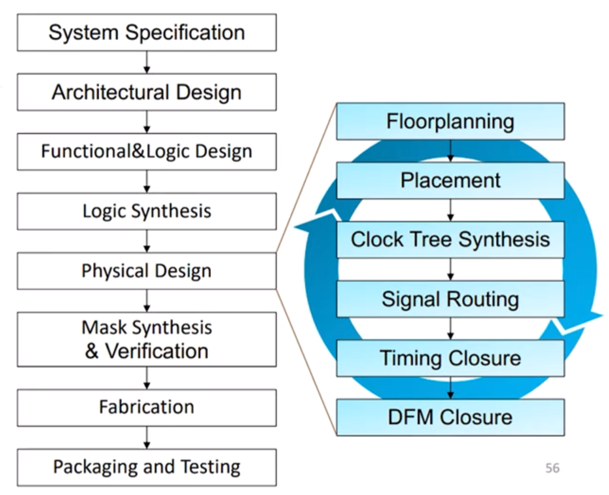  
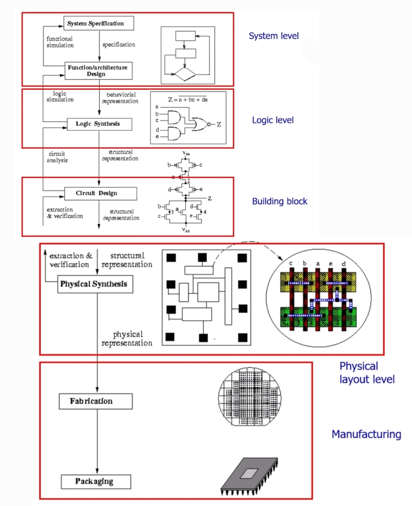  

## Synthesis & Technology mapping
Synthesis: increasing information about the design by providing more detail (e.g. logic synthesis, pyhsical synthesis)  

Logic synthesis: 把RTL轉換成gate-level netlist，因為RTL大多數都是用HDL (High-level Description Language)寫的，因此也有人稱為HDL synthesis，但嚴格來說HDL synthesis是被包含在Logic synthesis內  

Logic synthesis = Domain Translation (轉換成gate-level) + Optimzation (選擇要用哪些gate會最佳)  
Technology mapping是把設計綁定到某個製程(例如TSMC 7nm)，會從這個製程libary中挑選哪個gate會最佳，因此technology mapping是optimization的一環  

Physical synthesis: 在placement階段時優化size, buffer, ...，簡單理解就是實體層的最佳化  

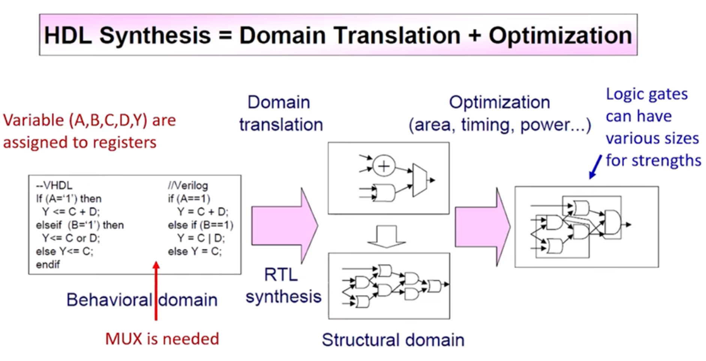  

## Design styles
IC設計之時的設計思路，設計時主要考量了performance, area, cost和time to market  
目前design style大宗有四種  
1. Full custom  
   完全從頭設計，performance最強且能保有小area，但cost高且time to market久  

2. Standard cell  
   用已經設計好的標準邏輯元件，只需要寫RTL再用EDA tool做synthesis, placement, routing, ...  
   performace, area和cost, time to market平衡，目前主流  

3. Gate array  
   晶片上已經預先做好很多transistor (base array) 只須修改metal layer來連接  
   因為已經有預先做好很多transistor所以cost較standard cell低，且所需時間短  
   但性能和彈性較standard cell差  

4. FPGA (Field-Programmable Gate Array)  
   最方便簡單入門兼容性高，因為晶片已經完成，可以透過燒錄program來完成預期的工作  
   為了高兼容性，所以FPGA內其實經常有很多以完成的部份是預期燒錄的program用不到的部份  
   因此area大performance差速度慢，但cost低且如果是小量產品可以快速開發完成  

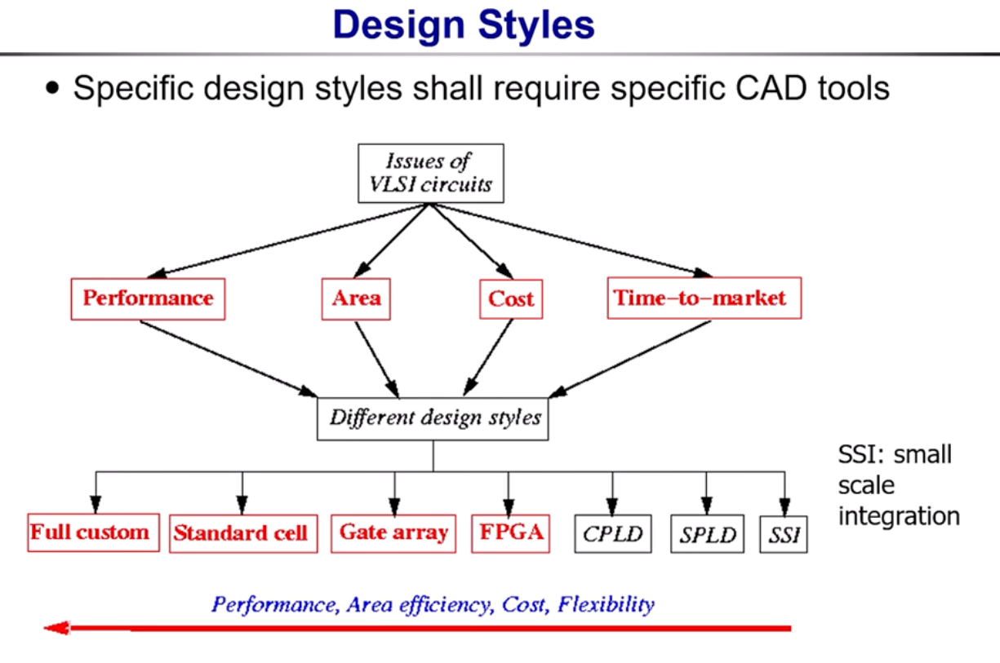  

## MOS transistors
pMOS: 當gate為0時會導通，pMOS導通signal "1"效果好 (因此經常接VDD)    
nMOS: 當gate為1時會導通，nMOS導通signal "0"效果好 (因此經常接GND)  
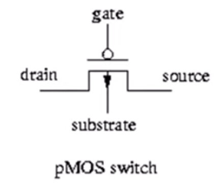  
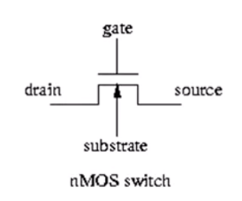  

因為pMOS和nMOS互補，所以經常搭配一起設計電路，稱為CMOS  
這邊以CMOS inverter為例，並介紹電路怎麼走達到inverter的效果  
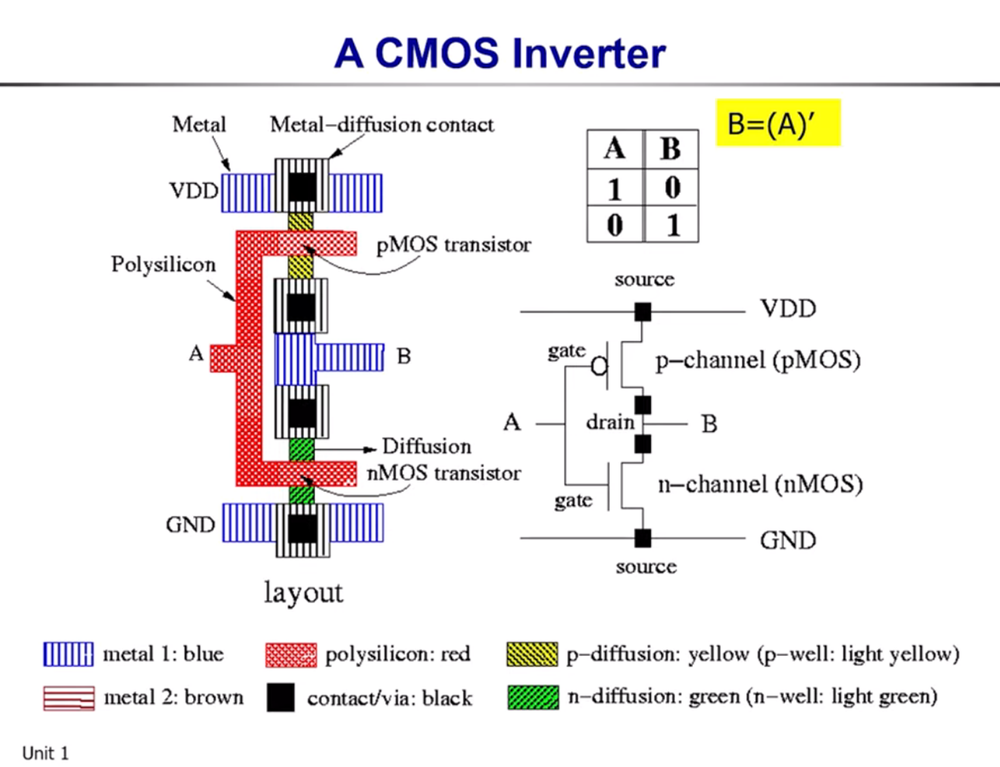  
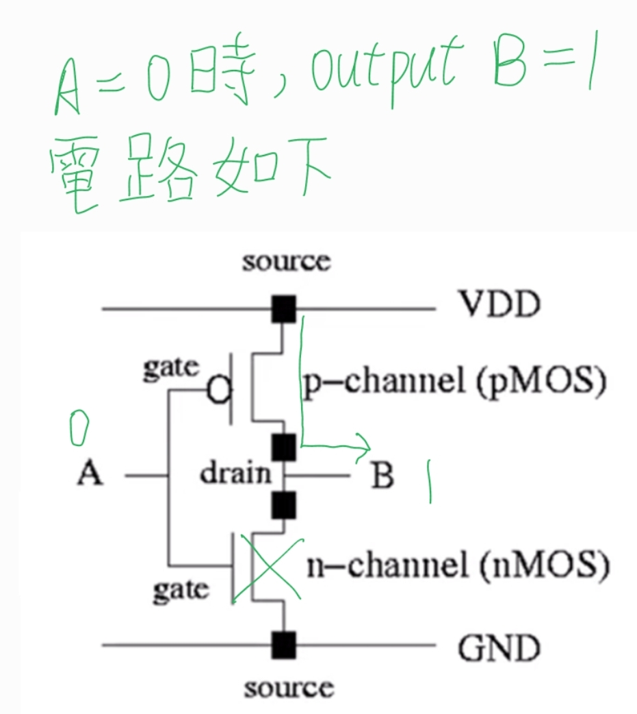  
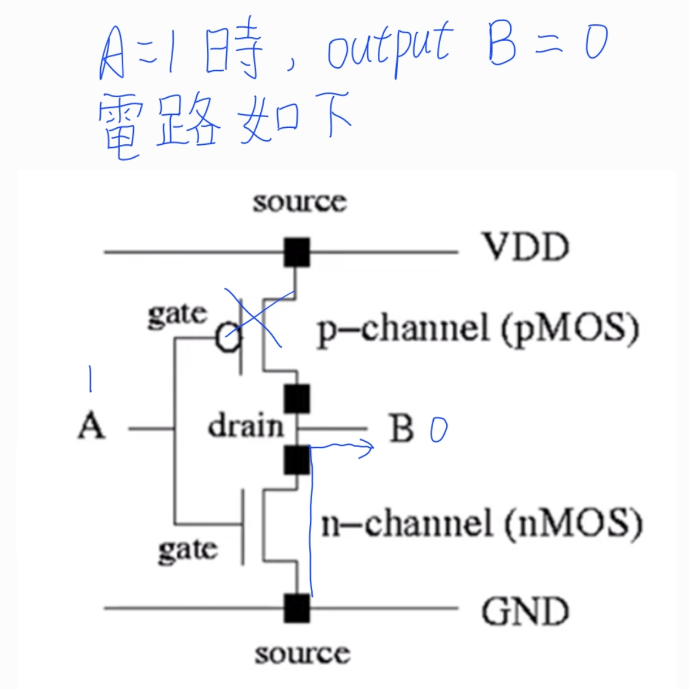  

下面一併放上CMOS的NADN和NOR  
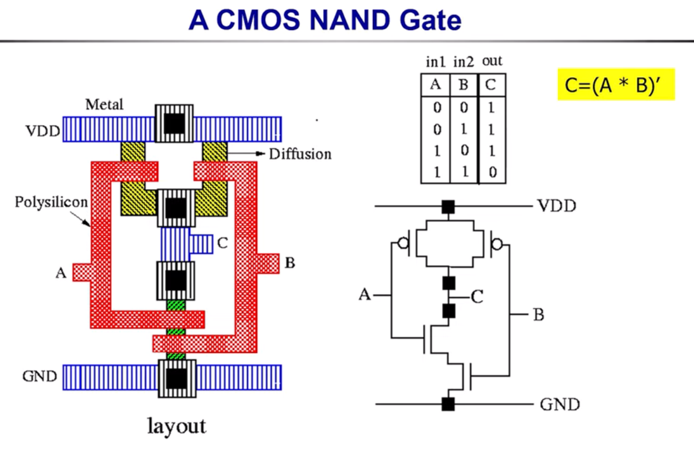  
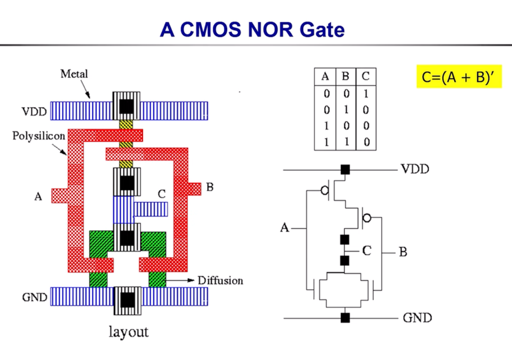  

### Consturction of Compound Gates
1. 將equation先取反，output為0的情況 (製作nMOS的部份)  
2. 將nMOS依照取反後的equation連接  
3. 將原本的equation展開，output為1的情況 (製作pMOS的部份)  
4. 將pMOS依照equation連接  

example:  
F = (AB + CD)'
1. 取反  
   F' = AB + CD  
2. 連接nMOS  
   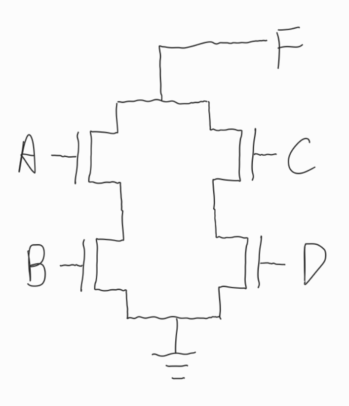  
3. 展開原本的equation  
   F = (A' + B')(C' + D')  
4. 連接pMOS  
   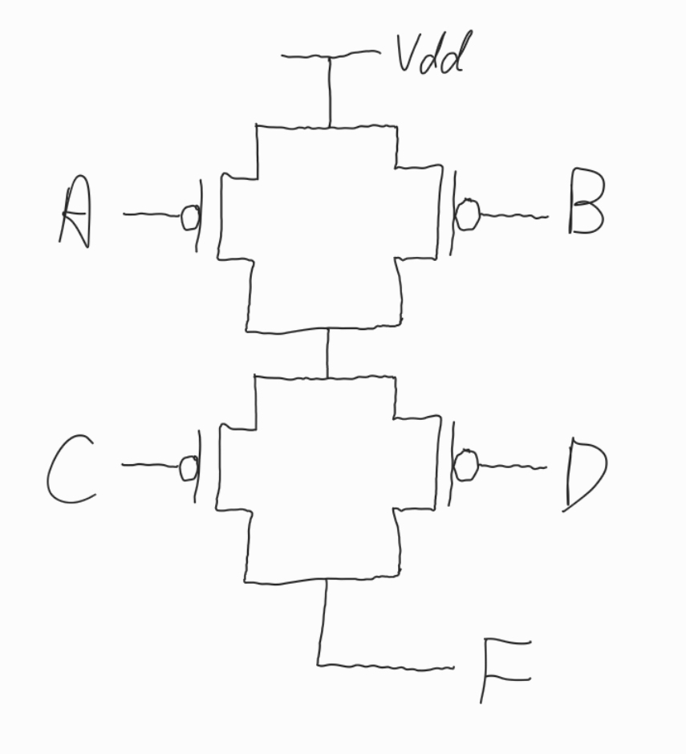  

最終成果如下  
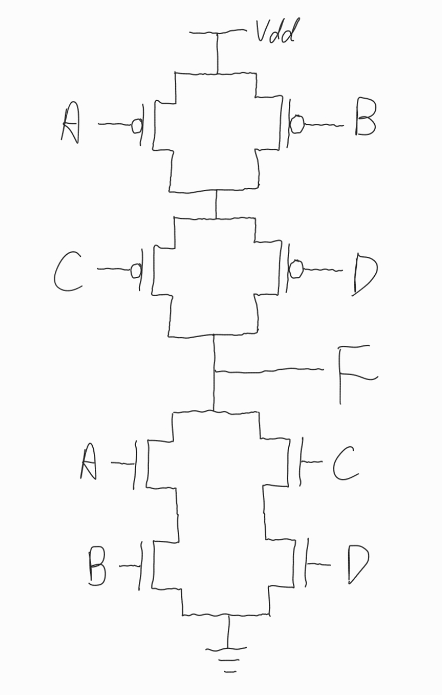  
