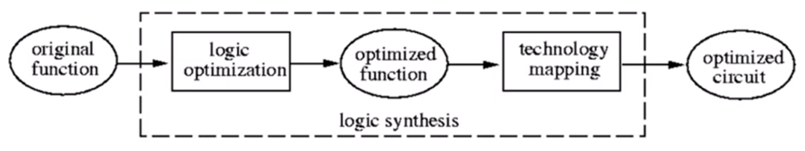
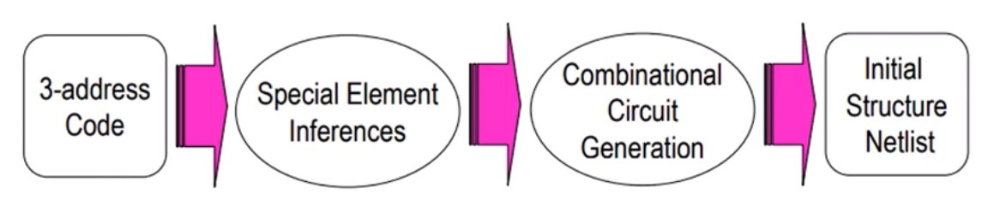
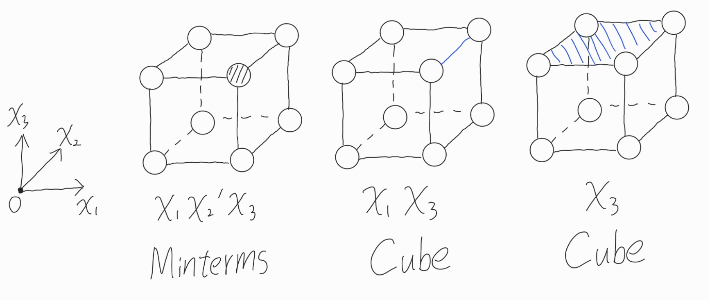
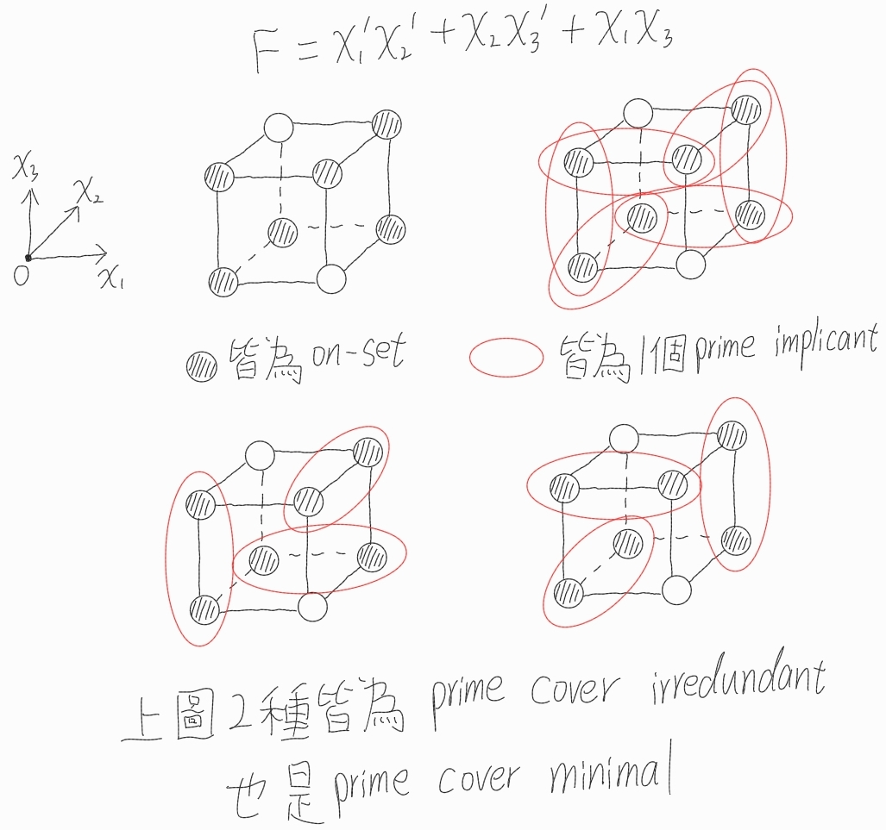
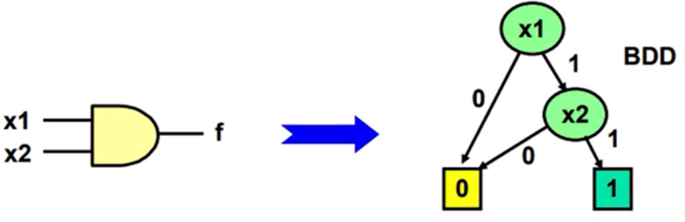
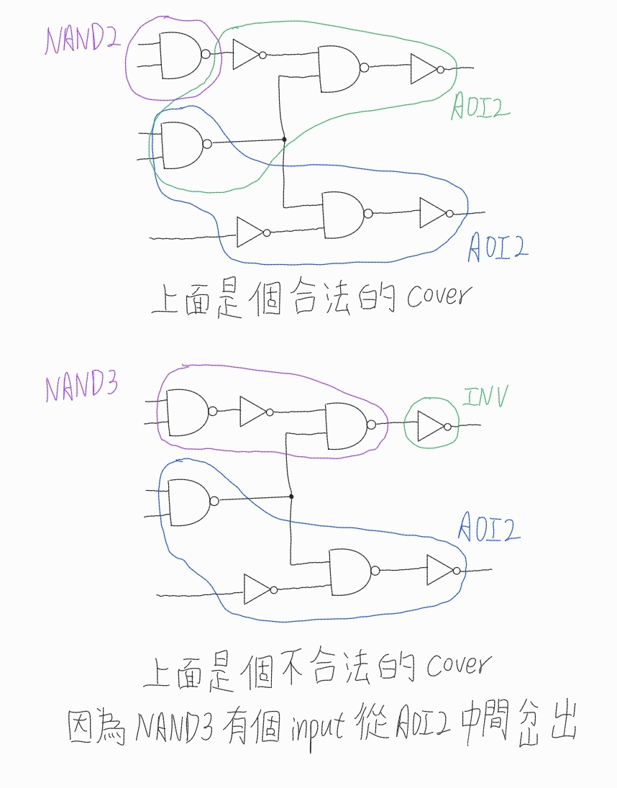
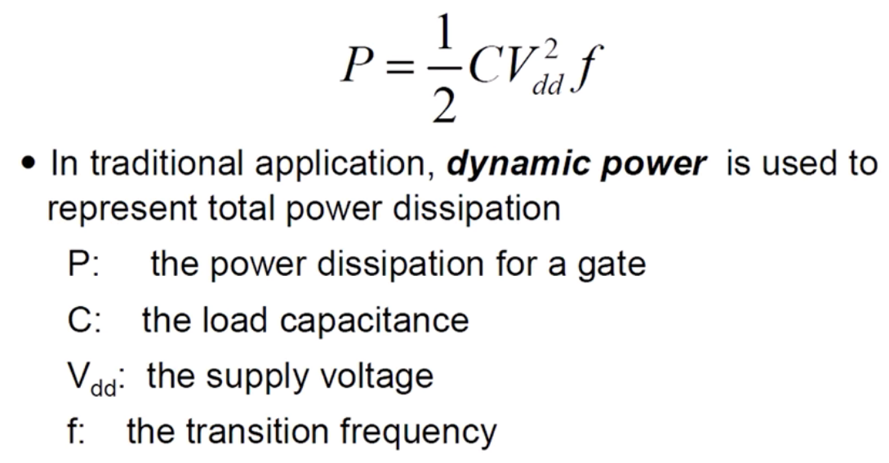
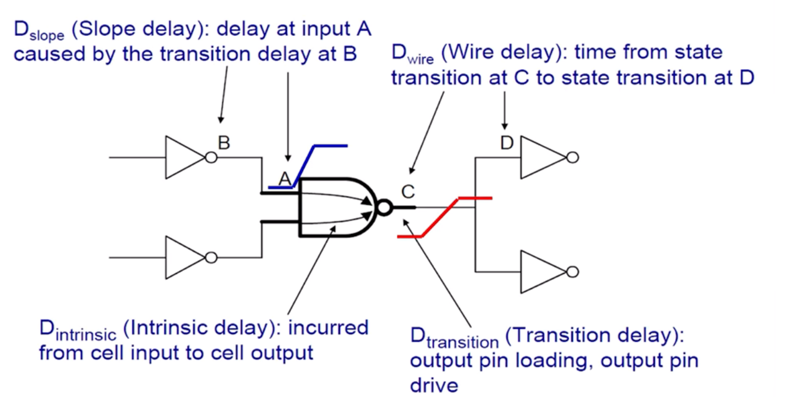

# Synthesis

Logic synthesis: 將Boolean expressions or Register-Transfer Level (RTL) description轉換成logic gate networks (netlist)再做technology mapping到特定的library

Verification: 檢查specification和implementation是不是equivalence

## Typical Domain Translation Flow

1. 把HDL code 轉成3-address format  
   3-address format是指有三個變數的形式，例如x = y op z

2. Conduct special element inferences  
   推導出特定的硬體和結構，例如哪裡要用register哪裡要用flip flop等等

3. Combinational circuit generation  
   把運算和控制轉換成純組合電路

## Logical Optimization

1. Technology-independent optimization  
   和technology無關就可以做的優化，通常是在Boolean expression做
   通常會去預估要用多少literal，使用一些common factor extraction和dimple delay model

2. Technology-dependent optimization  
   會和你要implement有關，要做technology mapping/library binding
   會把Boolean expressions map到特定的cell library並用更精確的model來去優化

### Two-level Logic Optimization

所謂的two-level是指SOP (sum of product) 或者是POS (product of sum) 的形式
例如: F = XYZ + XY'Z' + XY'Z + X'YZ + XYY'Z

業界常用的logic optimization，通常優化的criteria就是product/sum的數量or literal的數量

Two-level logic optimization的例子  
F = XYZ + XY'Z' + XY'Z + X'YZ + XYY'Z --> F = XY' + YZ

### Multi-level Logic Optimization

通常是去優化area, performance來去達到constraints
優化就不限於SOP or POS

Multi-level logic optimization例子  
F1 = ABCD + ABCE + AB'CD' + AB'C'D' + A'C + CDF + ABC'D'E' + AB'C'DF'  
F2 = BDG + B'DFG + B'D'G + BD'EG  
優化後可得  
X = D(B + F) + D'(B' + E)  
F1 = C(A' + X) + AC'X'  
F2 = GX

### Minterms and Cubes

1. Minterms  
   product of ***all*** input vriables or theris negations

2. Cubes   
   product of the input variables or theris negations (沒有要全部variable)
   當variable越少時，就會這個cube就會佔越大的空間

### Implicant and Cover

1. Implicant  
   是一個cube，這個cube所有的點要馬是on-set要馬是dc-set (don't care)

2. Prime implicant  
   是一個implicant，這個implicant已經是最大的涵蓋範圍了，若在擴大(增加一個變數)就會包到為0的部份

3. Prime cover  
   挑數個prime implicants，使得這些prime implicants涵蓋的所有on-set會等於原本的function

4. Prime cover irredundant  
   是指如果從這個prime cover拿掉任意一個implicant，就會使得這個cover不等於原本的function

5. Prime cover minimal  
   是指說這個prime cover包含了最少數量的prime implicant

例子: F = x1'x2' + x2x3' + x1x3  

### Canonical Forms

因為一個function可能有各種Boolean equations，這樣很難去比較，因此需要有一種唯一的表示function的方式，稱之為canonical forms

以往人們常用truth table或者是sum of minterms等等的方式作為canonical form，但其實都有很多問題  
因此有人提出***Reduced ordered binary decision diagram*** (ROBDD)作為canonical form

1. Binary decision diagram (BDD)  
   BDD是一個DAG，對於每個變數x都會有兩條路，分別是x = 1和x = 0，而這完整的DAG就是完整的function

2. Reduced  
   想辦法做簡化，有兩個標準化的規則
   1) 合併: 若兩個節點他們的0和1的subgraph皆相同，則這兩個節點就合併
   2) 刪除: 若某個節點他的0和1的subgraph完全一致，則刪除此節點

3. Ordered  
   必須是有序的，例如變數由大到小或由小到大

有了這三點，就能確保相同function會有唯一的表示式，也就是canonical form

#### Shannon Expansion

把Boolean equation根據某個變數做case split展開的定理  
$F = x_{1} * F_{x_{1}} + x_{1}' * F_{x_{1}'}$

通常要將一個Boolean equation轉換成ROBDD都會用Shannon expansion展開成一個desicion tree再做化簡

### Quine-McCluskey Algo

是two-level SOP最小化的演算法，很像是邏輯設計的K-map可程式化版本，但它能處理很多變數  
Input: function的on-set minterms和dc-set minterms  
Output: 成本最小的prime implicants cover

步驟大致如下:

1. 講所有minterms以binary表示，並依照1的數量進行分組

2. 反覆合併找出prime implicants  
   只能合併相鄰組(1的數量差1的)且只差1個bit，合併後把不同的bit改成don't care  
   例: 0101和0111 --> 01-1

3. 建立prime implicant table  
   將所有prime implicants列在column，將所有on-set minterms列在row  
   若某個prime implicant覆蓋某個minterm，就在table中標記

4. 選cover  
   先將essential prime implicants挑出來，在剩下的去挑選  
   set cover algo若data小會選擇Petricks method，若data大則會選擇heuristic method

## Technology Mapping

### Library-based Technology Mapping

做optimization，透過挑選pattern graphs in library來minimize cost covering的subject graph

1. pattern graphs  
   由library cell衍生出的結構模板，有可能是cell base, LUT, ... (簡單理解就是library內的cell圖形表示)

2. cover  
   每個subject graph的節點或是邏輯都有被pattern graphs所實現  
   節點或邏輯要被patter graph所cover還有一個條件，每個pattern graph的input必須要是其他pattern graph的output
   例如:  
   

#### DAGON

一種technology mapping的演算法，他的概念是Tree-Covering by Dynamic Programming  
Input: technology-independent的subject DAG和library cell
Output: local optimize過後的netlist

步驟大致如下:

1. 若subject DAG不是tree結構，則要partition成forest of trees

2. Normalize pattern graph

3. Optimally cover each tree  
   透過DP去把每棵樹做optimize

### LUT-based Technology Mapping

以FPGA的k-input LUT (lookup table)當作目標元件來做的technology mapping
k是任意數字，表示有幾個input，k-input LUT可以是任意Boolean function
通常LUT-based technology mapping的優化目標會是優先追求depth (LUT level)最小，因為depth會最大影響速度，再來考慮其他因素

### Multiplexer-based Technology Mapping

如同字面上的意思，並非以library or LUT做目標元件，而是以許多多工器來實現
核心概念是利用Shannon expansion對Boolean function展開

## Power Dissipation

只電路在運作時把電能轉換成轉換成其他形式消耗掉的功率，CMOS電路長把功耗分成3類

1. leakage power (ststic power)  
   即使不切換也會有的漏電電流，相較於另外兩者，此漏電電流數值很小

2. short-circuit power  
   當輸入切換時，會有一瞬間NMOS和PMOS皆為導通狀態，此時VDD會直接接到GND造成漏電

3. switching power (dynamic power)  
   當輸入切換時，因為電容的充電或放電造成的漏電，通常是最主要的power consumption

通常我們在計算上只會計算switching power，公式如下  

## Delay Model

通常有三種

1. Unit delay model  
   每個gate皆有delay 1

2. Unit fanout delay model  
   就是每個fanout會額外增加delay

3. Library deal model  
   用library的delay data來推算delay，有可能是linear or non-linear (tabular) models

### Linear Delay Model

$Delay = D_{slope} + D_{intrinsic} + D_{transition} + D_{wire}$

1. $D_{slope}$  
   因為輸入不是瞬間轉換的，所以會根據input電壓轉變得斜率而產生delay

2. $D_{intrinsic}$  
   Gate內部的晶體管等等的元件，造成input到output的delay

3. $D_{transition}$  
   Output產生時會需要推送到後面給各種元件，就會需要決定要多大的推動力  
   而這個所需要的推動力，會因為loading (後面元件的多寡)和 drive (這顆gate拉高電壓的能力) 有關  
   而產生這個推動力(讓輸出到位)的延遲稱為$D_{transition}$

4. $D_{wire}$  
   從一個pin到另外一個pin之間會經過的R, C, ...所產生的delay

