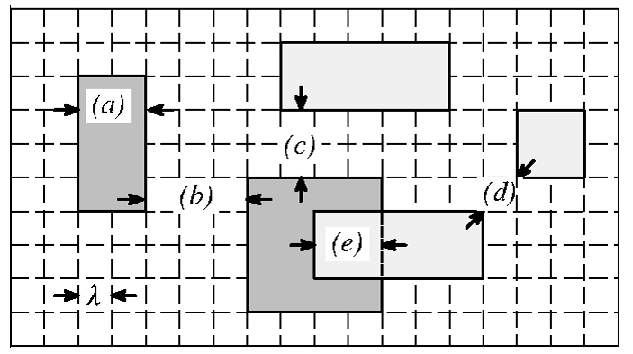
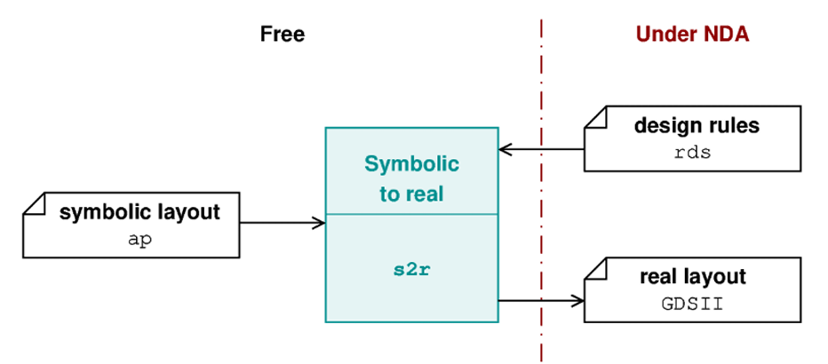
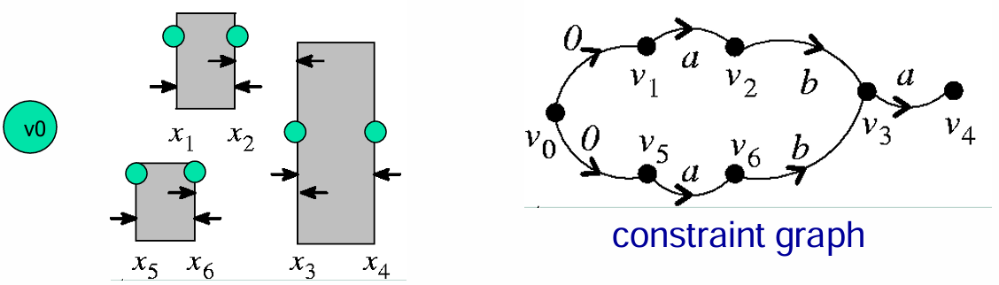
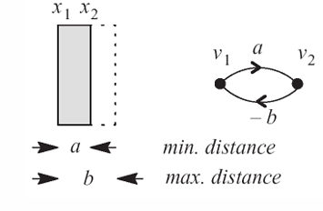

# Compaction

## 簡介

在不違反 DRC (design rule check) 和 netlist connectivity 的情況下，調整版圖中的元件以達到各種「壓縮」的目的，例如：最小化面積、在範圍內增加間距、改善良率等等。  
達到上面目的的這個程式叫做 compaction program 或 compactor。

## 先備知識

### Design Rule

Design rule 是 foundry 定出來的限制，若遵從這個限制去製造，就會大幅提升晶片製造的成功率。  
Pattern 和 design rules 經常會用 $\lambda$（單位，因為每個 foundry 限制的長度等等單位不相同）來表示。

常見的 design rule 例如：
1. minimum-width (a)
2. minimum-separation (b, c, d)
3. minimum-overlap (e)

### Geometric & Symbolic

Geometric (mask) layout：用實際可製造的多邊形在各層畫出其形狀與座標（座標通常是絕對值或 $\lambda$ 的倍數）。

Symbolic (topological) layout：只用線段、骨架、拓樸...表示元件的相對關係；symbolic layout 還可以 work with technology file 來產生 geometric layout。

## Compaction 的作法

1. 1D compaction：先做 x 方向再做 y 方向（或反過來）
2. 2D compaction：一邊 simulation 一邊做（NP-hard）

## Constraints 建模

### Minimum-distance Constraints

經常用來表示 minimum-width 或 minimum-separation，例如某個間距或某個 metal 要至少多寬等等：

$ x_{j} - x_{i} \geq d_{ij} $，其中 $x_{i}$ 和 $x_{j}$ 表示兩個邊。

我們可以透過這個條件，將 constraints 轉換成 graph 會是 DAG，在這個 DAG 中的 longest path 就是這個 layout 的 dimension。  
要找到這個 DAG 的 longest path，可以用 topological sort (BFS) 來找，步驟如下：

1. 先算出所有 vertex 的 in-degree
2. 找出 in-degree 為 0 的 vertex，將其 push 入 queue 中
3. 每次 pop 一個點出來，把此 vertex 接到的 vertex in-degree 減 1
4. 重複步驟 2 和步驟 3，算出所有 longest path

### Maximum-distance Constraints

像是有些 design rule 還會額外有 maximum-width，例如最大線寬等等。  
那這是除了上面的 $ x_{j} - x_{i} \geq d_{ij} $ 外，還會額外有：

$ x_{j} - x_{i} \leq c_{ij} $，或 $ x_{i} - x_{j} \geq -c_{ij} $

這時候將這些 design rule 轉換成 graph 就不會是 DAG，而是會產生 cycle。  
如果這個 cycle 是正的，那將不會有 solution for longest path，因為一直繞 cycle path 會越來越長。  
如果這個 cycle 是負的，就可以用 Liao-Wong Algorithm 來找 longest path，步驟如下：

1. 先把所有 edge 拆分成 forward path 和 backward path
2. 根據 minimum-distance 的作法先只考慮 forward path，算出 longest path
3. 把所有 backward path 加上去，若有 distance 因為加了 backward path 而變更長，重複步驟 2 和步驟 3
4. 當所有 backward path 加上去而不改變所有 distance 時，即可結束，獲得 longest path

> 也可以用 Bellman-Ford 來解 longest path
