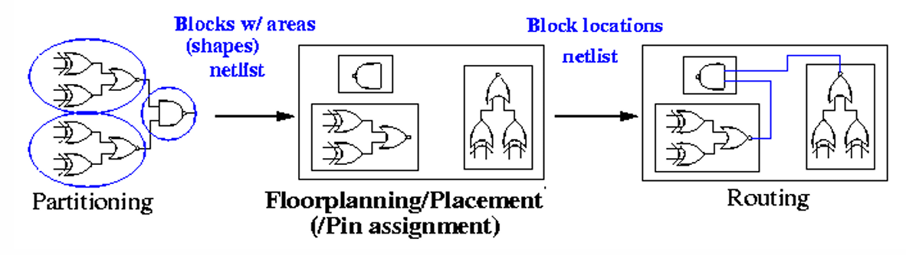
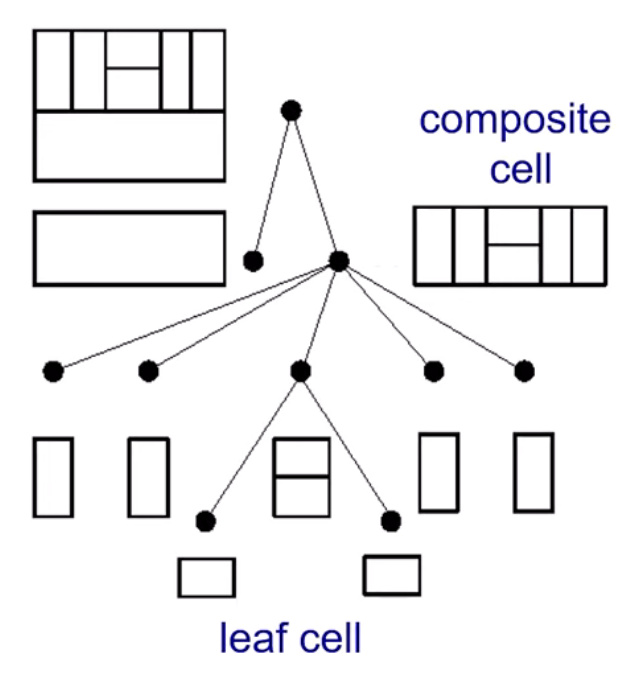
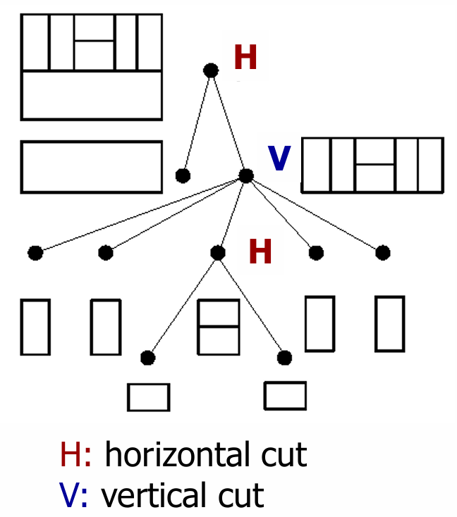
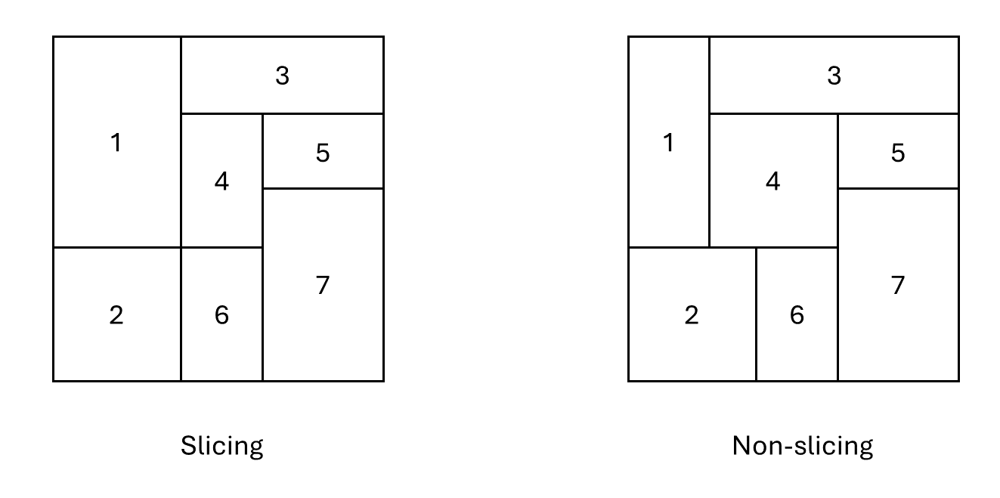
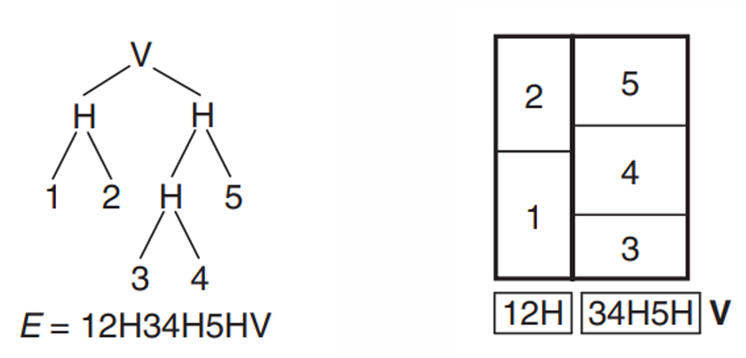
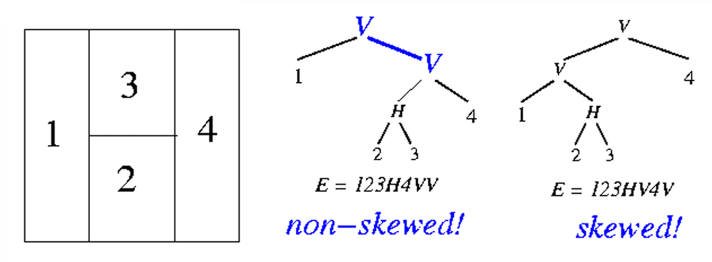

# Floorplanning
Partition把一個大的design拆成多個block/module等等的subsystem後，floorplanning決定這些block/module怎麼去擺它  
Floorplanning算是實際有擺物件的layout非常早期階段，因此可以在早期就做一些layout的評估  

> Floorplanning和placement很相似，因為都是擺放東西，在廣義上來說是相同的事情，但大多數會把floorplanning代表擺放大的block/module等等，而placement則是擺放較小的元件例如cell等等  

> Block有分兩種，hard block表示內部實作已經完成，例如他的dimension, pin已經固定，而soft block則是還只有邏輯描述，實作尚未完成  

  

## Slicing floorplan & Slicing tree
我們可以把一個floorplan design拆解成一個樹狀結構，其中的名詞  
1. Leaf cell (block/module)  
   Tree的leaf，代表這個cell當中已經不包含其他cell (block/module)了  

2. Composite cell (block/module)  
   Tree的non-leaf，代表這個cell (block/module)還可以繼續拆解成leaf cell或其他coposite cell  

  

我們知道每個composite cell可以繼續拆解，其中拆解法是以horizontal或vertical方法拆解  
這種拆解的表示稱為slicing floorplan  
Slicing floorplan可以用slicing tree來表示  

> Slicing floorplan又被稱為floorplan of order 2  

  

Slicing floorplan是在切的時候每一刀都切到底，也會有non-slicing floorplan，就是有一個像是循環結構的切法  
大家會盡可能的使用slicing的方法，因為這會讓後續的routing變得比較容易  

  

### Polish Expression  
將一個slicing floorplan用slicing tree表示，再用post-ordered的方式來表示  
Normalize Polish Expression (NPE): polish epxression當中沒有連續相同type的operators  

  

### Skewed slicing tree
若整棵樹的所有composite cell的切法和它的right child切法不同，則這棵樹被稱為skewed slicing tree  

為什麼需要skewed slicing tree呢?  
因為一個slicing floorplan可能會有好幾種slicing tree畫法，若用polish expression表示，可能會造成同一種polish expression畫出不同的slicing tree，因此需要一個***規範化***的slicing tree來盡可能減少polish expression所能代表的slicing floorplan  

  

> NPE + skewed slicing tree會讓slicing tree唯一  

## Wong-Liu Floorplanning Algo
利用NPE + Simulated Annealing (SA)來優化slicing floorplan，以達到最小cost (例如area, wire length, ...)  

### Neighbor move  
對於polish expression有2種adjacent  

1. Operands adjacent  
   是block的相鄰  
   例如: 1 6 H，1和6 operands adjacent  

2. Operand and operator adjacent  
   是block和slicing切法相鄰  
   例如: 1 6 H，6和H operand and operator adjacent  

此演算法定義了3種move來去改變slicing floorplan  
1. M1 (Operands Swap)  
   挑選一組operands adjacent交換兩個operands  

2. M2 (Chain Invert)  
   把H轉換成V，或V轉換成H  

3. M3 (Operand and Operator Swap)  
   挑一組operand and operator兩個位置互換  

### Problem formulation
給定blocks, nets以及constraints，盡可能最小化cost  
常見的cost例如area, area + $\lambda$ \* wire length  

### Steps
1. Initial NPE  
   對input初始化一個合法的NPE  

2. 設定SA的參數  
   初始溫度, 每個溫度要做的擾動次數N(T), 降溫策略, 終止條件, ...

3. Algo主體  
   一個iterrative會做N(T)次
   1) 每次會進行一個隨機的neighbor move  
   2) 判斷此次neighbor move是否合法，若不合法重抽，若合法繼續  
   3) 評估測次neighbor move的cost  
   4) 是否接受，若cost下降，直接接受，若沒有下降，則以機率接受  
   5) 紀錄當前最佳解  

4. 降溫  
   下降溫度並判斷是否結束，若沒有結束，回到step 3，否則結束

### Properties (Hard blocks)  
1. 因為以SA為演算法基底，因此有機會跳脫local optimize  

2. 每次move的time complexity為O(n)，n是block數，因為每做一次move，就要對整個NPE算cost  

3. Total time complexity為$O(m * n)$，m是做了m次iterrative  

### Properties (Soft blocks)  
因為hard blocks的長寬都是已經固定的，因此我們在計算cost時，不需要在額外考慮其他東西  
但是soft blocks是area固定，長寬不固定，因此這個soft block的長寬畫在平面上會是一個曲線，如下圖  
  

但是實際上在layout上會有一些極限，不可能說讓長非常短或是寬非常短，因此實際上的legal shape會被bound住  
  

除了無法有非常短的長或寬外，我們的長寬也不會是continuously的，會是discrete的，且cell是死板的，它通常只能rotate或是mirrored，因此實際上的legal shape會是一個階梯形狀  
  

因次在做soft block的Wong-Liu algo時  
1. 每次move的time complexity為$O(n * k^{2})$，k是可接受的長或寬保留點  

2. Total time complexity為$O(m * n * k^{2})$  

## Wheel Floorplan
