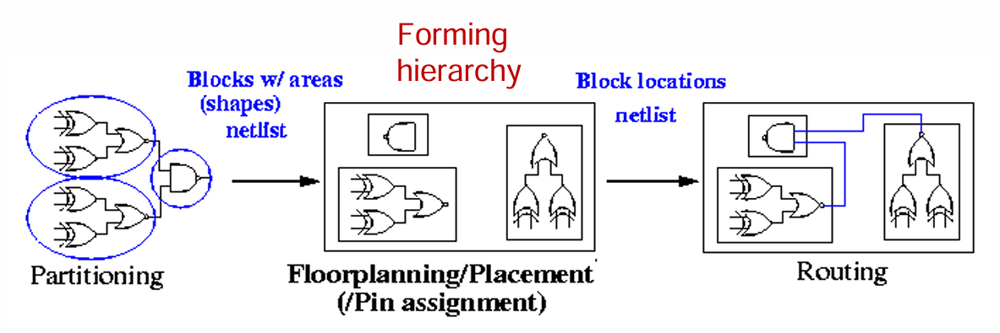
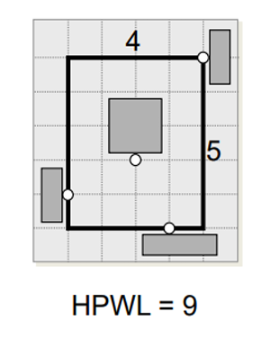
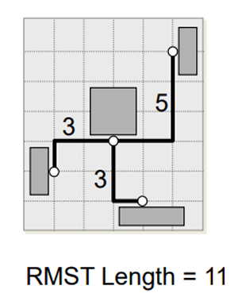
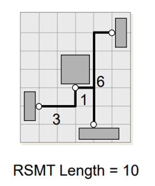
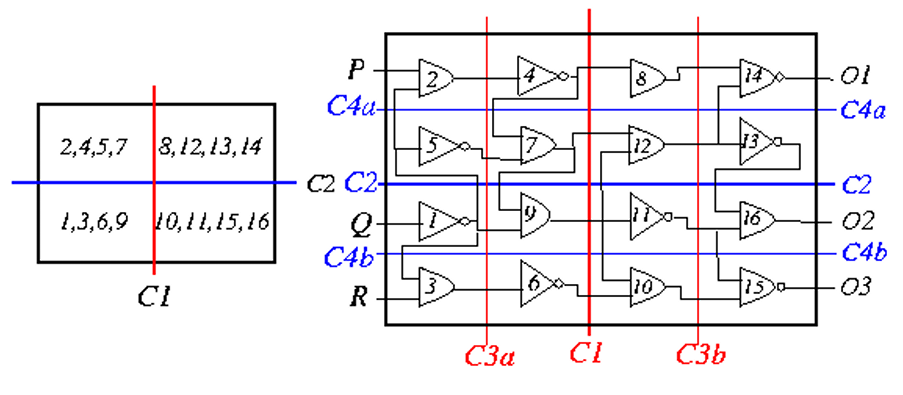
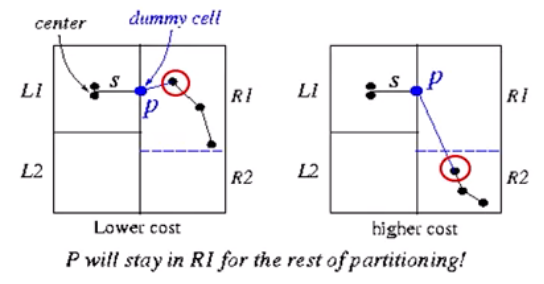
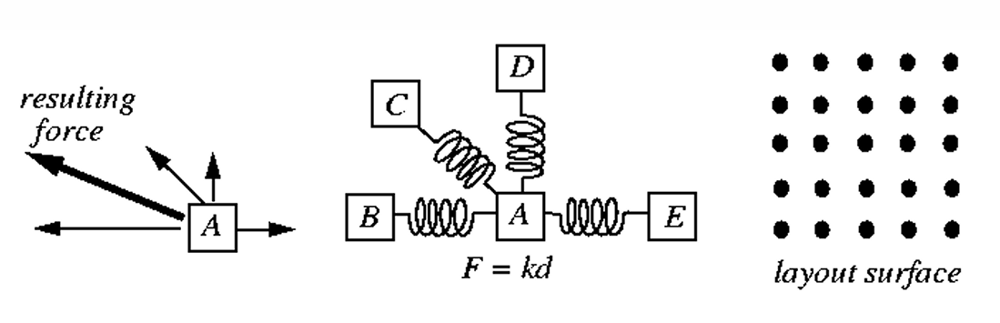

# Placement
自動把預先設計好的cell放置到正確的位置，使得我們預期的cost function會是最佳的  
通常在做placement的時候會有一些constraints，例如no cell overlap, no density overflow, ...  
  

在做placement的時候，通常會先做global placement，再去做detailed placement  
1. Global placement: 把這些standard cell等等的先大致擺在哪些row  
2. Detailed placement: 把instants, components擺進那些row內  

由於placement和routing關係非常緊密，因此理想情況下希望P&R是可以一起做的，但實際上會非常複雜  
因此現在大多數的作法還是分開來進行，且在進行placement時會大致去預估wirelength  

## Wirelength估計
以下介紹幾種估計WL的方法  
1. HPWL (Half Perimeter WireLength)  
   找出整個placement block最小X, Y和最大X, Y形成一個長方形bounding box  
   這個bounding box的半週長就是WL的預估值  
   這個方法快且常用  
     

2. RMST (Rectilinear Minimum spanning tree)  
   把每個pin以rectilinear minimum spanning tree連在一起去算總cost  
   計算相對簡單，會考慮到pin的分散程度，而不是指考慮到bounding box，較HPWL精準  
     

3. RSMT (Retilinear Steiner Minimum Tree)  
   把每個pin連接在一起，但可以有中繼點  
   更接近理想佈線，比RMST更準確  
     

## Placemnet Algorithms
常見的作法  
1. Constructive algo:  
   先決定好一個cell的position，在由哪些cell和起始cell有強connection去往外去延伸  
   例如: cluster growth, min cut, ...  

2. Iterative algo:  
   透過修改intermediate placements的方式來improve cost function  
   例如: force-directed method, ...   

3. Nondeterministic method:  
   例如: SA, genetic algorithm, ...  

4. Analytical method:  
   例如: Gordian, Gordian-L, RePlace, ...  

大多數的作法都是把各種方法融合在一起，有多個要素  

### Cluster Growth Placement
利用gready逐步長出一團彼此連的緊密的components (clsuter)  
核心有兩個步驟  
1. Select  
   在所有尚未放置的cell/modules裡挑選一個和已放置的cluster具有最緊密關係的  
   這個最緊密關係常見的定義有共享的net數最多, 和某個已放置的cell連線最強等等  

2. Place  
   把select到的cell放置到一個可用的slot上，使得部份placement的某個cost最小  

### Min-Cut Placement with Terminal Propagation
Min-cut placement是一種top-down的global placement方法，把一個電路視為一個netlist反覆得做bopartition使得cut size最小，且同時滿足面積/單元的平衡，演算法跟之前的partition大同小異，遞迴去分割使得cut size最小  

而with terminal propagation則是因為當我們進行第二次以上的min-cut algo時，它實際上只考慮到做cut的那塊區域的連線，但實際上它和其他區塊也還是有連線關係  
如下圖的(1, 3, 6, 9) region實際上和(8, 12, 13, 14) region是有connect的  
  

因此為了考量到外部區塊，它會將已經分割好的部份，映射到欲切區塊的某一個端點，形成一個虛擬pin，這樣就會考量到與外部區塊的連線  
  

### Force-Directed Placement
把placement的問題想像成是彈簧拉力問題  
就是把彈簧拉力$F=kd$，F是force, k是彈簧係數, d是距離映射到palcement問題  
變成$F=\sum wd$，其中F是force, w是weight, d是距離  

步驟約如下  
1. 從某個initial placement (fixed objects/IO, ...)  
2. 挑選一個最值得去place的cell (例如: force最大, 最重要, ...)  
3. 把它搬到force最佳的slot  
4. 若slot被佔用，則用ripple move, chain move, ... 找到合法位置  
5. 重複上述步驟直到完成  

  

### Gordian Placement
具有代表性的analytical placement，把placement拆成兩個部份然後相互交替  
1. 用quadratic wirelength做global optimize  
2. 用partition + constraint的方式把元件攤開避免全部擠在一起，讓其逐漸不重疊  

較完整的流程如下  
1. 先用固定的pin建立quadratic wirelength model  
2. Level 0: 沒有任何約束情況下作一次global optimize解全域最小 (通常會擠在一起)  
3. 做partition: 把版圖切成數個region，將cells分散到各區  
4. 為每個region建立重心constrain  
5. 用重心constraint下再做一次global optimize得到更分散的位置 (level +1)  
6. 重複3~5，直到符合條件  
7. 最後做final placement: 做legalization和detail placement微調  

上面是Gordian placement的大致步驟，和以往的方法比較不同，他是用數學模型來去解一個較佳解  
因此這邊要解釋一下上面的一些名詞和原理  

#### Quadratic Wirelength  
在現代的global placement會把問題視為***連續座標***的最佳化  
如果用HPWL或Manhattan distance這種***線性距離*** $L_{i, j} = \lvert x_{i} - x_{j}\rvert + \lvert y_{i} - y_{j}\rvert$，會發現無法微分  
因此改用***平方距離和*** $L_{i, j} = (x_{i} - x_{j})^2 + (y_{i} - y_{j})^2$，使其變成convex和連續可微  
後續就可以用Linear Algreba解  

#### 重心constrain
前面在講流程時會提到，如果不加以限制，會發現絕大多數我們找到的解會全部擠在一起  
因此我們在每次partition完後，會去增加一個硬限制  
這個硬限制是我被分配到這個region的cells他的加權平均重心會要落在這個region的中間  
如此以來在整體的global optimize時若把某些cell往整體的中心拉，就會要有cell往外圍拉以確保達到硬限制  

