# Routing
Routing是指在placement把元件擺放好位置後，用金屬層和via把每個net給實際連接起來，以滿足design rule和timing  
Routing和placement一樣通常會先做global routing再做detail routing
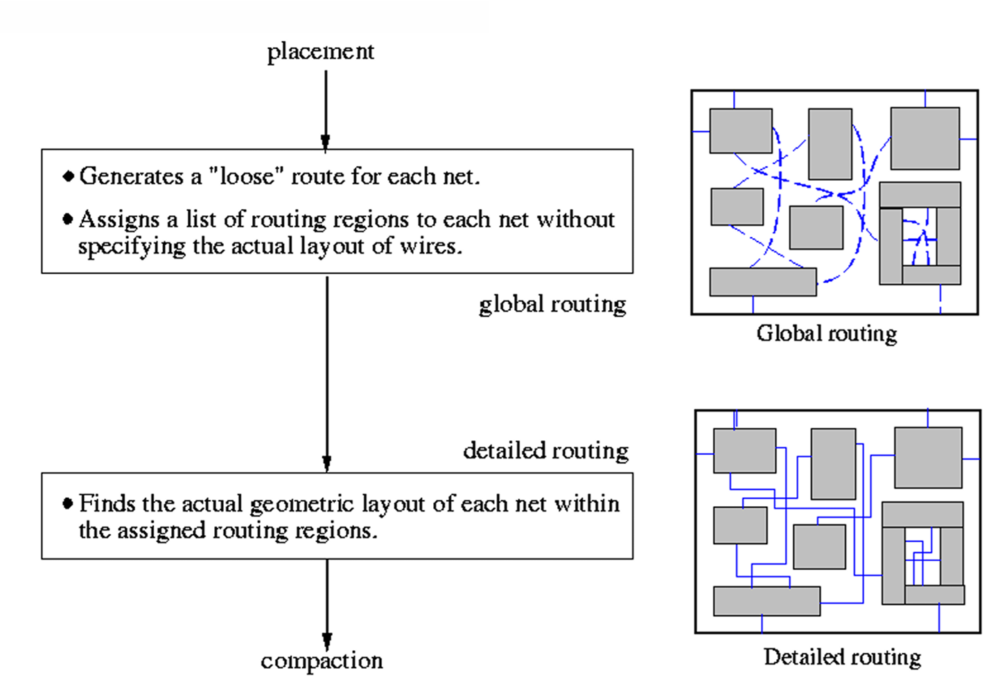  

下面這張圖是routing常見的方法的分類樹  
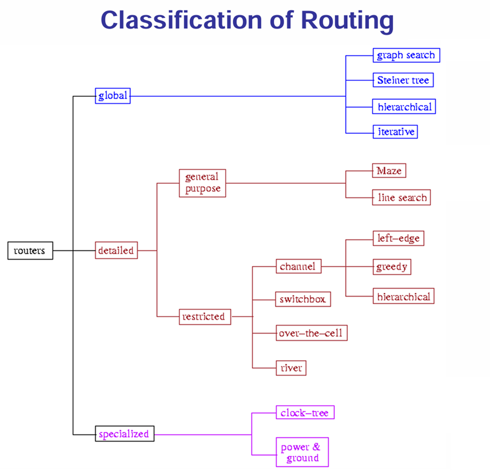  

## General Purpose Routing
### Maze Routing (Lee Algorithm)
在一層layer中，把整個design視為一個網格迷宮，cell視為障礙物，然後去找2個terminal間的shortest path  
最原始的Lee algorithm是用BFS來找尋shortest path  
優點是它一定可以找到兩個terminal間的最短距離，但缺點就是速度慢且需要大量的memory  
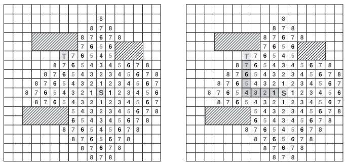  

他的time和space complexity皆為O(m\*n)，其中m\*n為網格的大小  

#### 其他Maze router Algorithm
因為Lee algotithm速度慢且耗費大量memory，因此出現了許多變形的algorithms來解決此類問題  

#### Hadlock's Algorithm
目標是在有障礙的隔點上找最短的Manhattan distance，這樣可以避免Lee algorithm全域爆炸式的搜索  

其核心概念是如果走得下一步使得Manhattan distance變大，則稱為detour，cost為當前cost + 1  
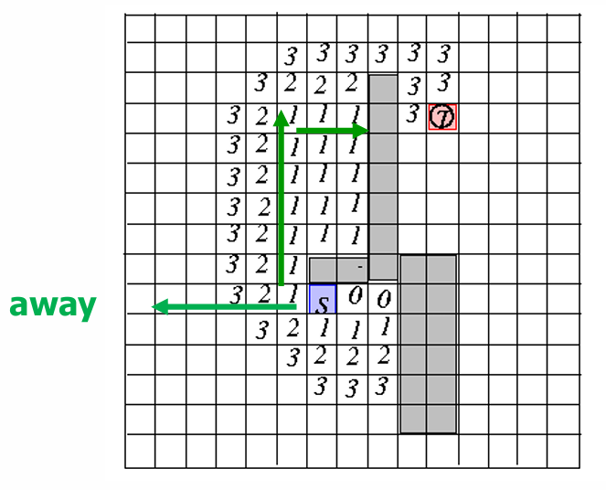  

而path length = (起點和終點的Manhattan distance) + (detour num)  
不過若是path是有權重的，則上面的公式將不會成立  

#### Soukup's Algorithm
一樣是Lee Algorithm的變形，此演算法結合了DFS和BFS，兩者交替使用進而達到提昇速度的目的  

此方法核心是再沒有遇到障礙物時，用DFS盡可能的朝目標前進，若是遇到障礙物，則切換成BFS尋找轉折  
以下圖為例，黑色圓圈就是以DFS進行，而白色圓圈則是以BFS進行  
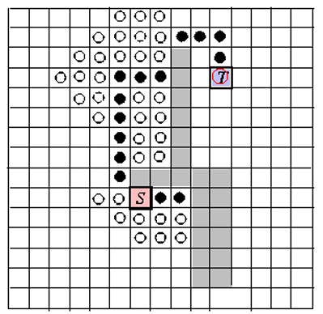  

但用這種方法找到的path不見得會是shortest path  

### Line Search Routing
和前面的Lee algorithm不同，不是整個網格往外擴散去search path，而是line延伸來去找路徑  

#### Mikami-Tabuchi's Algorithm (MTA)
Line search routing的一種，它會先從source和target去往水平垂直的去延伸一條線，然後去看source和target有沒有交集  
若沒有交集，則從線上的每一個點繼續水平垂直延生，直到找到交集，即為找到path  
在延伸出去的線上的每一個點，都稱為***escape point***  
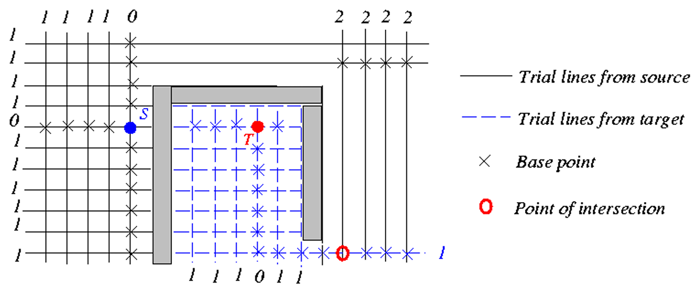  

但是此方法找到的path不一定會是shortest path  

#### Hightower's Algorithm
MTA的變形，MTA中線上的每一個點都是escape point，而Hightower每一條線只會有一個escape point  
這個escape point會放置在線剛好超過障礙物的位置  
這個方法避免了MTA從多個escape point去爆炸式增長去找交集的缺點  
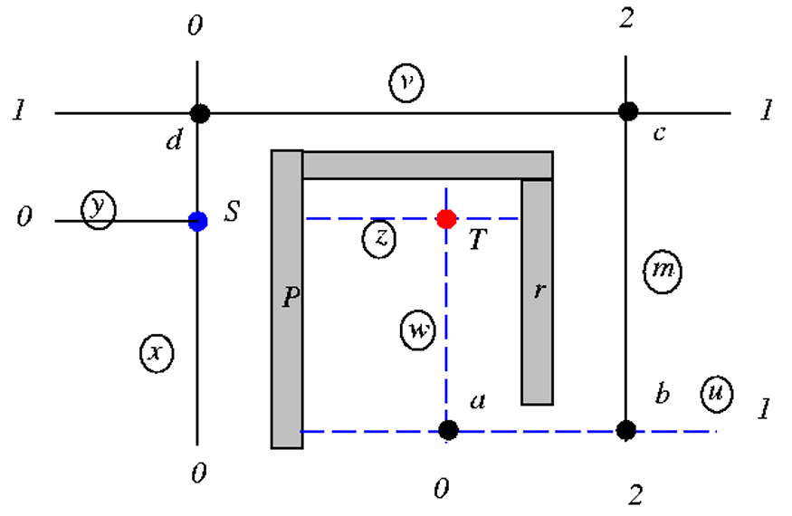  

但這個方法不一定有辦法找到路徑，就算有找到路徑，也不見得是shortest path  

### A\* Search Routing  
從maze routing改良，因為Lee algorithm是BFS的去search path，其實有很多search的path是多餘的  
因此A\* search改良成有目的性的往target去search  

核心想法是A\* search的cost function為$f(x) = g(x) + h(x)$  
其中$f(x)$是從source到current node的total cost  
$g(x)$是本來的path所需的cost  
$h(x)$是預估從current node到target的cost  

常見的$h(x)$例如Manhattan distance  
因此當我們往了遠離的target的方向走，$h(x)$會增加，因此使得在search時盡可能的往target移動  

## Global Routing
### Sequential Global Routing
最直覺的方法，就是一條一條按照順序去拉線，但其實會遇到嚴重的net ordering問題，造成效果很差  

Net ordering是指決定哪些net先去做routing會大幅度的影響最終的結果  
如下圖a和b兩個net，若先拉a在拉b，會發現cost增加，因此應該要先拉b  
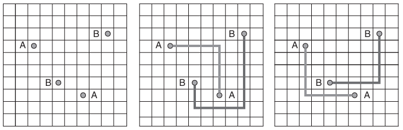  

那如何決定哪些net先拉是一個困難的問題，常見的作法有以下幾種  
1. Order by pin (通常pin越多的越晚拉，因為pin越多通常能夠容忍的範圍較大)  
2. Order by net的length (HPWL之類的)  
3. Order by timimg criticality  

但其實也沒有一定的規律說哪個net先拉就比較好  
因此常見的解決方式例如以heuristic方式做net ordering或是做***rip-up and rerout***  

Rip-up and rerout的意思是說當我們在拉某一條net時，發現它走得最佳位置被其他net給佔據了  
因此我們就先把擋在路徑上的net拆掉，後續在去重拉它此net  

但現今的chip非常複雜，除了net ordering還有congestion問題，即使永rip-up and rerout還是效果很差或是找不到解  

### Concurrent Global Routing
因為sequential global routing的問題，因此衍伸出concurrent global routing，不要一次只考慮一條net，而是一次全域考慮  

其核心概念是先為每條net準備幾調候選路徑，在一次考慮全域最佳化去挑選每條net要選擇哪一條  

### Steiner Tree
前面的algorithm主要都是針對net是兩個pin的，如果今天的net不只是兩個pin相連  
以往常見的方法像是Minimum Spanning Tree (MST)，但MST經常只找到suboptimal solution  
因此提出了加入中繼點的Minimum Rectilinear Steiner Tree (MRST)，就可以找到較佳的結果  

但是我們該如何找到有幾個中繼點要在哪裡設置中繼點，又變成令一個問題  
直到***Hanan theorem***出現，證明了所有steiner point只會出現在***Hanan grid***上  
讓這個問題從無限多成可能，變成有限的數量  
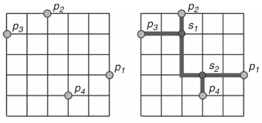  

#### Hanan Grid
把一個net的所有pin做水平和垂直的延伸，兩兩線的焦點所組成的集合就是Hanan grid的所有點集合  
所有的線和點就是Hanan grid  
因此如果1個net有n個pin，則可能的中繼點數量為n\*n - n  
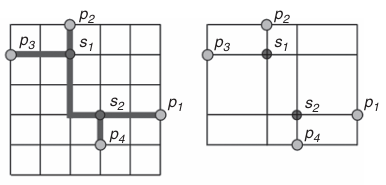  

## Detail Routing
在global routing完之後，detail routing會去實際擺放net實際的tracks和via位置  
主流的作法有兩個，一個是channel routing，另一個是full-chip routing  

### Channel Routing
Channel是指cell或block之間的通道，而channel routing則是只把上下邊界的pin連接起來  

#### 名詞解釋  
1. Track  
   可擺放走線的水平位置稱為track  

2. HV routing model  
   在現代chip routing中，通常在backend的每個metal層都只會有一個方向  
   例如第一層(M0)金屬線皆為horizontal，第二層(M1)皆為vertical  

3. Trunk  
   Horizontal的走線稱為trunk  

4. Branch  
   Vertical的走線稱為branch  

5. Dogleg  
   如果一個net有兩條以上的trunk，則稱之為dogleg  

6. Channel height  
   Channel能夠擺放的track數量  

7. Channel density (local density)  
   在一個column中涵蓋的net的數量  

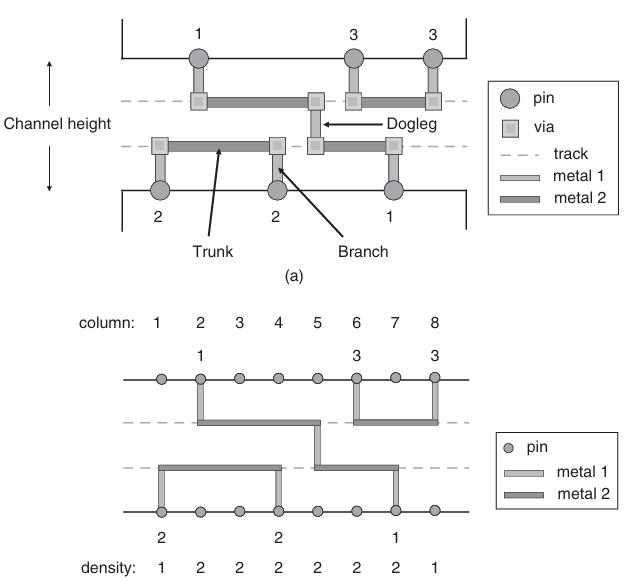  

#### Dogleg Channel Routing
Dogleg channel routing是一個常見的channel routing，它核心有三步  
1. 把multi-pin net拆成兩兩pin相連  
2. 建構horizontal constraint graph (HCG)和vertical constraint graph (VCG)  
3. 根據HCG和VCG的constraint去routing  

在channel routing時有兩個重要的constraint，就是上面第二步的HCG和VCG  
1. HCG  
   HCG是一個undirected graph，若在同一個column上有重疊的net則有一條edge  
   其限制是指不同net所放置的trunk不能放在同一條track上(否則會有short)  

2. VCG  
   VCG是一個directed graph，同個column上，在上邊界某個net的pin到下邊界變成另一個net的pin  
   則有一條directed edge從上邊的net指到下邊的net  
   其限制是指會強迫某個net的trunk在上面  

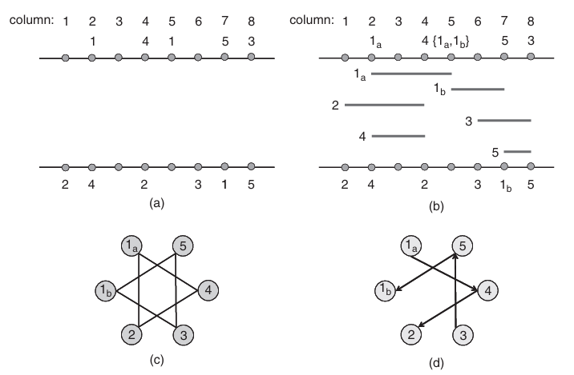  

### Full-chip Routing
在現代chip design中，routing很常不只是發生在channel，也很常需要跨block之類的  
因此要考慮整個chip design把所有net做完***global routing + detail routing***  

Full-chip routing的核心概念就是global routing + detail routing  
但如果用傳統的flat routing方法，雖然直觀易懂，但graph複雜，因此速度慢又耗費大量記憶體  

因此要採用***divide-and-conquer***的方法，把整個大chip拆分成小部份來解  
其中一個常用的方法為multilevel routing  

#### Multilevel Routing
是一個bottom-up + top-down的流程  

一開始會把整個chip design graph做***coarsening***把整個chip desgin的gcell慢慢合併成粗略的grid  
但是這個粗略的grid是有考慮過整個chip design的細節(bottom-up)  

接著先對這個粗略的grid做routing，在慢慢的做***uncoarsening***慢慢的在變成精細的grid  
在做uncoarsening時也會一邊修復失敗或是congestion的routing  
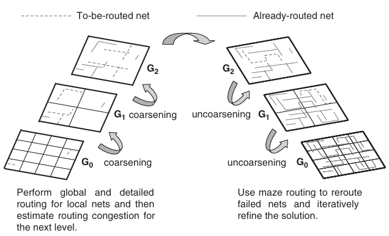  

